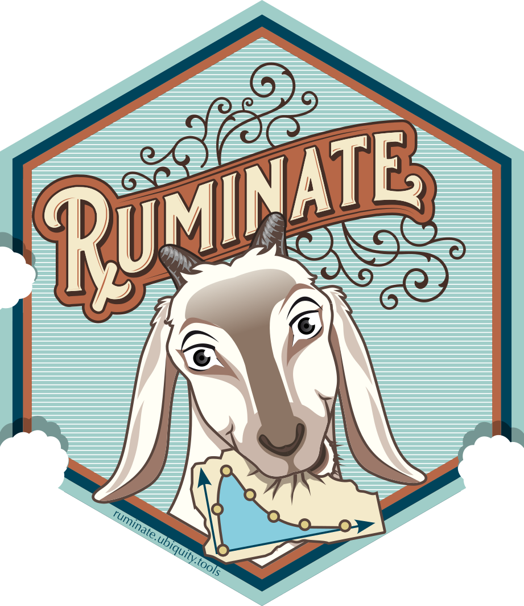

<!-- README.md is generated from README.Rmd. Please edit that file -->

```{r, include = FALSE}
knitr::opts_chunk$set(
  collapse = TRUE,
  comment = "#>",
  fig.path = "man/figures/README-",
  out.width = "100%"
)
```

# ruminate 

<!-- badges: start 
[](https://github.com/john-harrold/ruminate/actions)
-->

<!---
[](https://CRAN.R-project.org/package=ruminate)
 

---> 


<!-- badges: 
[](https://lifecycle.r-lib.org/articles/stages.html)


[ruminate](<https://rumiante.ubiquity.tools>) 
end -->

The goal of `ruminate` is to facilitate exploration of pharmacometrics data. This is done by creating a Shiny interface to different tools for data transformation (`dplyr` and `tidyr`), plotting (`ggplot2`), and noncompartmental analysis (`PKNCA`). These results can be reported in Excel, Word or PowerPoint. The state of the app can be saved and loaded at a later date. When saved, a script is generated to reproduce the different actions in the Shiny interface.

# Installation
<!---
You can install the released version of ``rumiante`` from [CRAN](https://cran.r-project.org/package=ruminate) with:

``` r
install.packages("ruminate")
```
--->


You can install the development version from [GitHub](https://github.com/john-harrold/ruminate/) with the following:

``` r
# Installing devtools if it's not already installed
if(system.file(package="devtools") == ""){
  install.packages("devtools") 
}
devtools::install_github("john-harrold/onbrand",  dependencies=TRUE)
devtools::install_github("john-harrold/formods",  dependencies=TRUE)
devtools::install_github("john-harrold/ruminate", dependencies=TRUE)
```

Note that because `ruminate` depends on `formods` and `onbrand` you will need to first install the development versions of `onbrand` and `formods`.

# Getting started


``` r 
library(ruminate)
ruminate()
```

# Using with Docker

## Run locally


If you want, you can download the Docker file [here](https://raw.githubusercontent.com/john-harrold/ruminate/main/inst/docker/Dockerfile). This will build the docker image from the repository on GitHub.

```bash
docker build -t ruminate  https://raw.githubusercontent.com/john-harrold/ruminate/main/inst/docker/Dockerfile
```
This will run the Docker image locally:

```bash
docker run --name ruminate --rm -p 3838:3838 ruminate
```

This will push the image to DockerHub:

```bash
docker tag ruminate <username>/ruminate:latest
docker push <username>/ruminate:latest
```

You can use this to pull the image from DockerHub:

```bash
docker pull <username>/ruminate:latest
```
